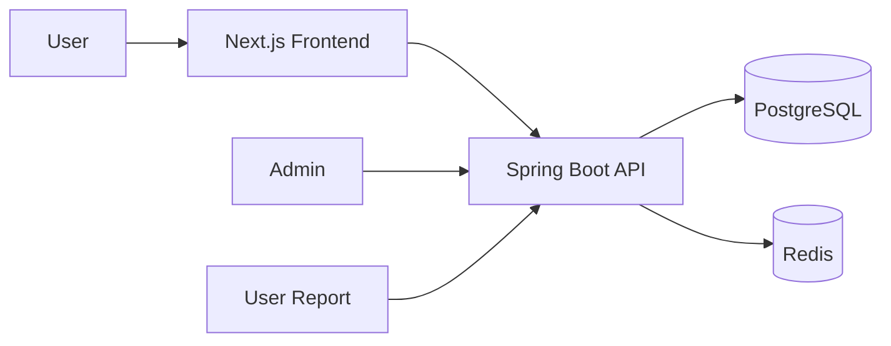
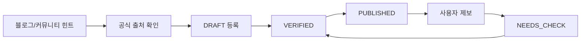

# 13. 포트폴리오 README 초안

# Zup

브랜드별 생일 쿠폰, 무료 혜택, 할인 정보를 공식 출처 기준으로 정리하고 조건별로 빠르게 확인할 수 있는 검색 유입형 정보 큐레이션 웹서비스입니다.

## 프로젝트 소개

생일 혜택 정보는 각 브랜드 앱, 멤버십 안내, FAQ, 공식 공지, 블로그, 커뮤니티에 흩어져 있습니다.

기존 검색 결과는 대부분 블로그 글이라 최신성이 불확실하고, 앱 필요 여부·멤버십 조건·사용 가능 기간을 한눈에 비교하기 어렵습니다.

이 프로젝트는 브랜드별 생일 혜택을 구조화하고, 사용자가 조건별로 빠르게 필터링할 수 있도록 만든 정보 큐레이션 서비스입니다.

## 왜 만들었는가

단순히 생일 혜택을 나열하는 것이 아니라, 블로그 글의 한계를 서비스 구조로 해결하고 싶었습니다.

- 브랜드별 혜택 정보를 공식 출처 기준으로 검수합니다.
- 혜택마다 최근 확인일과 공식 출처를 표시합니다.
- 앱 필요 여부, 멤버십 필요 여부, 생일 당일/생일월 여부를 태그로 구조화합니다.
- 사용자가 잘못된 정보를 제보할 수 있게 합니다.
- 관리자 페이지에서 검수 상태와 오래된 데이터를 관리합니다.
- 브랜드별 상세 페이지와 카테고리/태그 페이지를 SEO-friendly URL로 제공합니다.

## 주요 기능

### 공개 사용자 기능

- 브랜드별 생일 혜택 조회
- 브랜드 상세 페이지
- 카테고리별 혜택 조회
- 조건 태그별 혜택 조회
- 조건별 필터링
- 정보 수정 제보
- 공식 출처/최근 확인일 확인

### 관리자 기능

- 브랜드 등록/수정/비활성화
- 혜택 등록/수정/상태 변경
- 공식 출처 관리
- 검수 상태 관리
- 사용자 제보 관리
- 오래된 데이터 확인
- 조회수 기반 인기 데이터 확인

## 핵심 설계 포인트

### 1. 공식 출처 기반 데이터 관리

블로그/커뮤니티 글은 수집 힌트로만 사용하고, 실제 게시 데이터는 공식 홈페이지, 앱, 멤버십 안내, FAQ, 공식 공지사항을 기준으로 검수합니다.

### 2. BenefitSource 분리

혜택 정보와 출처 정보를 분리해 하나의 혜택에 여러 출처를 연결할 수 있도록 설계했습니다.

이를 통해 공식 출처, 앱 확인, 고객센터 답변, 참고 블로그를 구분할 수 있습니다.

### 3. VerificationStatus

혜택 정보는 아래 상태로 관리합니다.

```text
DRAFT → NEEDS_CHECK → VERIFIED → PUBLISHED
```

사용자 제보나 공식 출처 변경이 감지되면 다시 NEEDS_CHECK 상태로 전환할 수 있습니다.

### 4. 최근 확인일

각 혜택에는 `lastVerifiedAt`을 표시합니다.

사용자는 정보가 언제 확인되었는지 알 수 있고, 운영자는 오래된 데이터를 우선 재검수할 수 있습니다.

### 5. SEO URL 구조

브랜드/카테고리/태그 페이지를 검색 유입에 맞게 설계했습니다.

예:

```text
/brands/starbucks
/categories/cafe
/tags/free
/tags/no-app-required
```

## 기술 스택

### Backend

- Java 21
- Spring Boot
- Spring Web
- Spring Data JPA
- Spring Security
- PostgreSQL
- Redis

### Frontend

- Next.js
- React
- TypeScript
- Tailwind CSS
- Axios
- Zustand

### Infra

- Docker Compose
- Nginx
- AWS EC2
- GitHub Actions 예정

## 아키텍처



## 데이터 검수 흐름



## 로컬 실행 방법

```bash
cp .env.example .env
docker compose -f docker-compose.dev.yml up -d
```

Backend:

```bash
cd backend
./gradlew bootRun
```

Frontend:

```bash
cd frontend
npm install
npm run dev
```

Health check:

```http
GET http://localhost:8080/api/v1/health
```

## MVP 범위

구현 목표:

- 브랜드 목록
- 브랜드 상세 페이지
- 카테고리/태그 페이지
- 조건 필터
- 정보 수정 제보
- 관리자 CRUD
- 공식 출처 관리
- 최근 확인일 관리
- SEO 기본 설정

MVP에서 제외:

- 사용자 회원가입
- AI 추천
- WebSocket
- 자동 크롤링 대량 수집
- 브랜드 로고 무단 사용
- 앱 출시
- 결제/광고 관리 기능

## 향후 개선

1. 조회수 기반 인기 혜택 랭킹
2. 최근 확인일 90일 초과 자동 경고
3. 공식 출처 변경 감지
4. 신규 가입 혜택 확장
5. 제휴 링크 실험
6. Search Console 기반 SEO 개선

## 포트폴리오 어필 문장

브랜드마다 흩어진 생일 혜택 정보를 공식 출처 기준으로 구조화하고, 조건 태그·최근 확인일·검수 상태를 통해 정보 신뢰도를 관리하는 큐레이션 서비스를 구현했습니다.

단순 CRUD가 아니라 관리자 검수 흐름, 사용자 제보, 조회수 집계, SEO-friendly URL 설계를 포함해 실제 운영 가능한 정보 서비스 구조를 만들었습니다.

검색 유입 실험을 위해 브랜드 상세·카테고리·조건 태그 페이지를 설계하고, 향후 공식 출처 변경 감지 및 신규 가입 혜택 확장까지 고려했습니다.
